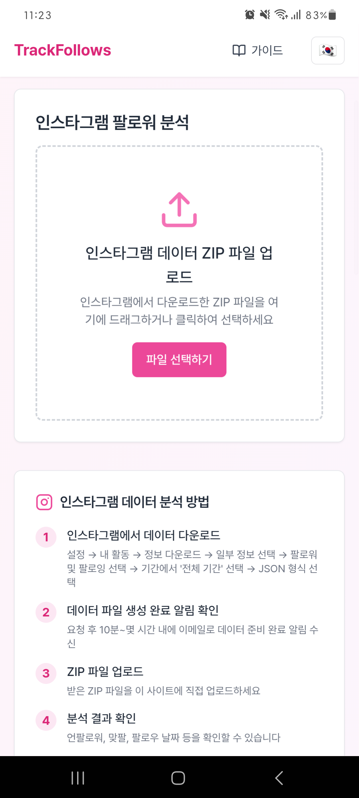
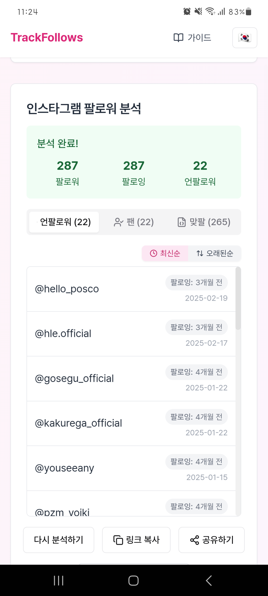

# 📱 Instagram UnFollower Tracker

Flutter WebView 기반으로 만든 **인스타그램 언팔 확인 웹뷰 앱**입니다.  
인스타그램 데이터 파일을 업로드하면, 누가 나를 언팔했는지 확인할 수 있습니다.

## 📦 소개

- **웹 기반 인스타 언팔 분석 서비스**를 Flutter 앱으로 감쌌습니다
- 출시 후 **63,000명 이상 방문**, 그중 **31,000건 이상 분석 성공**
- **15개 언어 지원**, 국가별 자동 언어 설정
- HTML, JSON, ZIP 등 다양한 파일 형식 지원
- 실제 사용자 로그 기반 오류 개선으로 전환율 상승 → 📈 **28% → 50.4%**

---

## 🧪 주요 성과

| 항목         | 수치 (2025.03.05 ~ 05.05기준)                                                                                |
| ------------ | ------------------------------------------------------------------------------------------------------------ |
| 총 방문자 수 | **63,479명**                                                                                                 |
| 분석 성공 수 | **31,996건**                                                                                                 |
| 분석 성공률  | 28% → 50.4% 개선                                                                                             |
| 지원 언어 수 | **15개국어** (한국어, 영어, 일본어, 스페인어 등)                                                             |
| 배포 플랫폼  | Google Play Store ([바로가기](https://play.google.com/store/apps/details?id=com.hyjoong.trackfollows&hl=ko)) |

👉 아래는 실제 유입 및 분석 전환 데이터 (Vercel 기반)

---

## 📷 앱 화면

| 홈 화면                                | 분석 결과 화면                               |
| -------------------------------------- | -------------------------------------------- |
|  |  |

---

- 🌐 [웹에서 바로 체험하기](https://trackfollows.com)
- 📱 [Google Play 스토어에서 다운로드](https://play.google.com/store/apps/details?id=com.hyjoong.trackfollows)
- 🍎 [App Store에서 다운로드](https://apps.apple.com/us/app/trackfollows-인스타-언팔-확인/id6747464895)

## 📖 관련 블로그 글

- [런칭부터 검색 유입까지 – 유입 만들기까지의 모든 실험](https://velog.io/@hyunjoong/insta-unfollow-launch-seo-growth)
- [사용자 실수를 성공으로 – 전환률 28% → 50% 만든 UX 개선기](https://velog.io/@hyunjoong/insta-unfollow-ux-error-fix)
