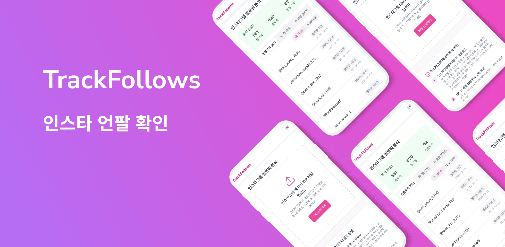

# 📱 Instagram UnFollower Tracker

Flutter WebView 기반으로 만든 **인스타그램 언팔 확인 웹뷰 앱**입니다.  
인스타그램에서 받은 데이터 파일을 업로드하면, **나를 언팔한 계정을 분석**해줍니다.

## 📦 소개

- 📦 **기존 웹 서비스를 Flutter 앱으로 포장**
- 🌐 **15개 언어 지원**, 국가별 자동 언어 설정
- 🧾 다양한 파일 형식 지원: HTML, JSON, ZIP
- 📈 사용자 로그 기반 개선 → 전환율 28% → 50.4%

---

## 🧪 주요 성과

### 📌 출시 후 2개월 기준 (2025.03.05 ~ 2025.05.05)

| 항목         | 수치             |
| ------------ | ---------------- |
| 총 방문자 수 | **63,479명**     |
| 분석 성공 수 | **31,996건**     |
| 분석 성공률  | 28% → 50.4% 개선 |

👉 실제 유입 및 전환 데이터 (Vercel 기반)

### 📌 출시 후 3개월 기준 (2025.03 ~ 2025.06)

- 누적 방문자 수: 140,055명

---

## 📱 앱 성과 요약

### Android (Google Play)

#### 📊 핵심 지표

| 기간                    | 기기 획득 수 | MAU        |
| ----------------------- | ------------ | ---------- |
| 2025.07.04 ~ 2025.07.31 | **1.67천**   | **1.62천** |
| 2025.09.15 ~ 2025.10.14 | **2.48천**   | **3.08천** |

- 첫 실행 수: 2025.07 기준 **1.00천**, 2025.10 기준 **1.46천**
- 7일 유지율: 2025.07 기준 **37%**, 2025.10 기준 **60%**

#### 📸 스크린샷

<table>
  <tr>
    <th>2025.07 스냅샷</th>
  </tr>
  <tr>
    <td>
      
    </td> 
  </tr>
    <th>2025.10 스냅샷</th>

  <tr>
   <td>
      
    </td>
  </tr>
</table>

### iOS (App Store)

#### 📊 핵심 지표

| 기간                    | 다운로드 수 |
| ----------------------- | ----------- |
| 2025.07.04 ~ 2025.07.31 | **612**     |
| 2025.09.15 ~ 2025.10.14 | **3.6천**   |

#### 📸 스크린샷

<table>
  <tr>
    <th>2025.07 스냅샷</th>
  </tr>
  <tr>
    <td>
      
    </td> 
  </tr>
  <tr>
     <th>2025.10 스냅샷</th> 
  </tr>
  <tr>
    <td>
      
    </td>
  </tr>
</table>

---

## 📷 앱 화면

| 홈 화면                                | 분석 결과 화면                               |
| -------------------------------------- | -------------------------------------------- |
|  |  |

---

## 🌐 직접 사용해보세요!

- 🔗 [웹에서 바로 체험하기](https://trackfollows.com)
- 📲 [Google Play에서 설치하기](https://play.google.com/store/apps/details?id=com.hyjoong.trackfollows&hl=ko)

- 🍎 [App Store에서 설치하기](https://apps.apple.com/ko/app/trackfollows-인스타-언팔-확인/id6747464895)

---

## ✍️ 관련 글 보기

- [런칭부터 검색 유입까지 – 유입 만들기까지의 모든 실험](https://velog.io/@hyunjoong/insta-unfollow-launch-seo-growth)
- [사용자 실수를 성공으로 – 전환률 28% → 50% 만든 UX 개선기](https://velog.io/@hyunjoong/insta-unfollow-ux-error-fix)
